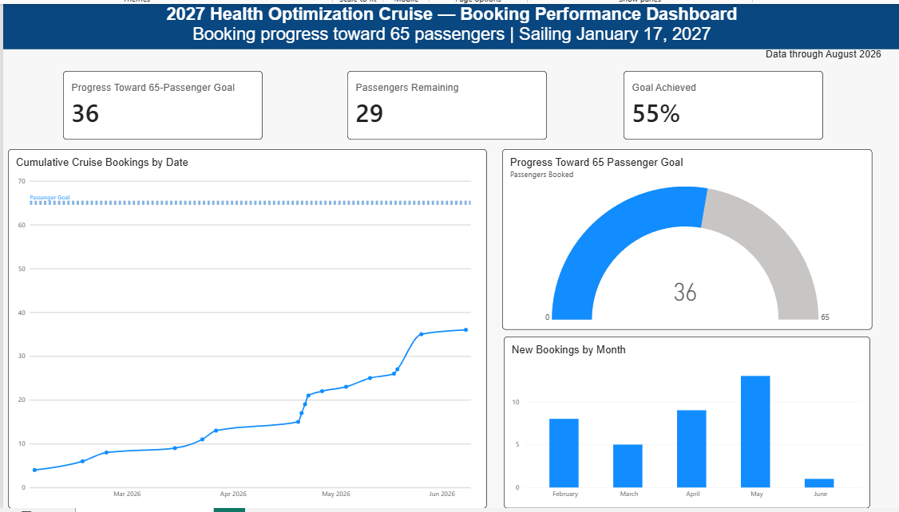

# Health-Optimization-Cruise-Booking-Dashboard
Developed interactive BI dashboards analyzing nonprofit marketing performance, cruise booking trends, and digital audience engagement using Power BI, SQL, DAX, and R.*
Health Optimization Cruise Booking Dashboard
Project Overview
This Power BI dashboard tracks booking performance for the 2027 Health Optimization Cruise, a nonprofit wellness event organized by A Plant-Based Diet. The dashboard converts passenger-level booking records into a concise view of progress toward the goal of 65 passengers before the January 17, 2027 sailing date.
This project demonstrates my ability to translate a business objective into clear performance measures, prepare data for analysis, create DAX measures, and design an executive-friendly dashboard.

Business Question
Is the cruise on track to reach its goal of 65 passengers, and how are bookings changing over time?
The dashboard helps stakeholders quickly understand:
How many passengers have booked
How many additional passengers are needed to reach the goal
What percentage of the goal has been achieved
How cumulative bookings are progressing over time
How many new bookings were received each month
Dashboard Features
Passengers Booked: Current number of confirmed passengers
Passengers Remaining: Difference between the 65-passenger goal and current bookings
Goal Achieved: Percentage of the passenger goal completed
Cumulative Booking Trend: Running total of passengers by booking date
Goal Reference Line: Visual comparison of current bookings with the target
Monthly Booking Volume: Number of new passengers booked each month
Data-Through Date: Indicates the reporting period covered by the dashboard
Data Preparation
I prepared the source booking data for reporting by:
Reviewing passenger and booking-date fields for consistency
Ensuring passenger IDs were treated as identifiers rather than values to be summed
Setting booking dates to the correct date data type
Creating date-based fields for monthly analysis
Validating that KPI totals, cumulative results, and monthly booking counts agreed
Keeping personally identifiable passenger information out of the published dashboard
Measures and Analysis
I used DAX measures to calculate the key performance indicators and running totals displayed in the report. The analysis includes:
Distinct passenger count
Cumulative passenger count by booking date
Remaining passengers needed to reach the goal
Percentage of the booking goal achieved
Monthly passenger acquisition totals
Example running-total logic:
```DAX
Cumulative Passenger Count =
CALCULATE(
    DISTINCTCOUNT(Bookings\[Passenger ID]),
    FILTER(
        ALLSELECTED(Bookings\[Booking Date]),
        Bookings\[Booking Date] <= MAX(Bookings\[Booking Date])
    )
)
```
> Table and column names may differ from those in the original Power BI file.
Tools and Skills Demonstrated
Microsoft Power BI
Power Query and data preparation
DAX measures and cumulative calculations
KPI definition and goal tracking
Time-series and monthly trend analysis
Data validation
Dashboard layout, branding, and visual storytelling
Stakeholder-focused reporting
Key Insights
At the time shown in the dashboard:
36 passengers had booked
29 additional passengers were needed to reach the goal
55% of the 65-passenger goal had been achieved
May generated the strongest monthly booking volume in the displayed period
The cumulative trend showed a notable increase in bookings during late May
These findings give event organizers a clear baseline for evaluating marketing performance and planning future booking campaigns.
Repository Contents
```text
health-optimization-cruise-power-bi-dashboard/
├── README.md
├── dashboard-preview.png
├── Health\_Optimization\_Cruise\_Dashboard.pbix
└── sample-data/
    └── anonymized-bookings.xlsx
```
About the Project
This is a real-world analytics project created to support planning and decision-making for a nonprofit event. The published portfolio version uses summarized visuals use anonymized data to protect passenger privacy.
